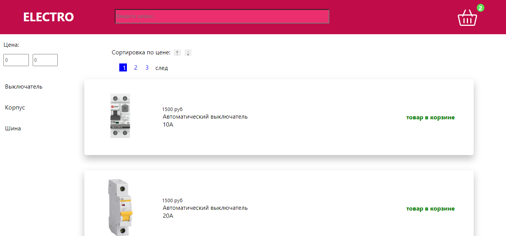

## О проекте:  

Этот проект является магазином электротоваров. В нем предусмотрены различные фильтры(по цене, по категории товара и поиск по названию товара), возможность добавления товаров в корзину и подсчет общей стоимости заказа. Так же, перейдя на страницу товара можно оставить комментарий к выбранному товару.  
Проект взаимодействует с сервером используя REST API.  

## В проекте использованы следующие технологии:  
Type script  
Next.js(React hooks)  
Redux(Redux hooks, Redux Thunk)  
React-hook-form  
В качестве бэкэнда использован Firebase через REST API  

## Для запуска проекта выполнить следующие команды:  

Для клонирование репозитория: git clone https://github.com/ortkyu/newsSite.git  

Инициализация проекты:  

npm install 
или 
yarn install  

Запуск проекта:  

npm run dev 
или 
yarn dev  

Приложение запускается на http://localhost:3000  

В браузере переходим по адресу:  http://localhost:3000  

